# Architecture Diagram

Create a stakeholder-friendly, high-level architecture diagram for the named software system. The diagram must explain what the system does and how its major components collaborate without exposing implementation-level detail.

## Required input

Collect or infer these system facts from the user's request:

- Software name and purpose
- Main business value or function
- Known core components
- External systems and third-party integrations
- The standard end-to-end workflow
- Core technology for each included module, if known

If essential facts are missing, ask focused questions before producing the diagram. Do not invent protocols, technologies, or integrations. Mark genuinely unknown technology as `Nicht angegeben` in the summary table.

## Modeling rules

1. Use exactly 5 to 8 central blocks where possible. Include only the components needed to explain the main workflow.
2. Represent modules, subsystems, or services—not classes, methods, deployment nodes, tables, or detailed schemas.
3. Show external systems and third-party providers as clearly separate external blocks. Use a distinct style for them.
4. Every block must contain:
   - A concise module name.
   - Its primary function in no more than five words.
5. Every arrow must show both direction and communication semantics. Label each edge with this exact conceptual format:
   `[Triggered action / data type] via [protocol / method]`
6. Prefer one clear, mostly directional flow. Avoid crossing edges and unnecessary bidirectional links.
7. Include the central standard workflow. Do not add secondary flows unless they are necessary to understand the system boundary.
8. Keep labels short enough to remain readable. If a label would become unwieldy, shorten the action or data type rather than adding implementation detail.
9. Use `flowchart TD` or `flowchart LR`. The Mermaid output must be syntactically valid and directly renderable.
10. Escape or quote labels containing punctuation that could be interpreted as Mermaid syntax. Use stable, simple node IDs such as `webClient`, `backend`, and `externalAuth`.

## Mermaid conventions

Use a subgraph only when it improves boundary clarity. A suitable baseline is:

```mermaid
flowchart LR
    user["User<br/>Starts workflow"]
    webClient["Web Client<br/>Collects input"]
    backend["Backend Service<br/>Processes requests"]
    database["Database<br/>Stores state"]
    externalAuth["External: Identity Provider<br/>Authenticates users"]

    user -->|"Credentials via OAuth 2.0"| externalAuth
    externalAuth -->|"Access token via OAuth 2.0"| webClient
    webClient -->|"Business request via HTTPS/JSON"| backend
    backend -->|"State changes via SQL"| database

    classDef internal fill:#e8f1ff,stroke:#2563eb,color:#172554
    classDef external fill:#fff4e5,stroke:#d97706,color:#451a03
    class webClient,backend,database internal
    class externalAuth external
```

Adapt the nodes, labels, direction, and styles to the actual system. Do not copy this example's components into a diagram unless the user supplied them.

## Required response format

Return exactly these two parts, in this order:

1. A fenced Mermaid code block containing the complete diagram. The fence language must be `mermaid`; the first diagram line must be `flowchart TD` or `flowchart LR`.
2. A Markdown table with exactly these columns:

   | Modulname | Hauptaufgabe | Verwendete Kerntechnologie |
   | --------- | ------------ | -------------------------- |

List every diagram block exactly once, including external systems. Keep each responsibility concise and ensure it does not exceed five words. For external systems, state the provider or integration technology when known.

Do not add a lengthy architectural essay, implementation plan, or code-level explanation below the table. A short clarification is allowed only when a fact was explicitly marked as unknown.

## Quality check before responding

- The diagram is valid Mermaid and uses `flowchart TD` or `flowchart LR`.
- There are 5–8 central blocks, unless the user's system genuinely requires fewer.
- Every block has a name and a function of at most five words.
- Every edge has direction and a label containing `via` plus a protocol or method.
- External systems are visually distinguishable and named as external.
- No class, table schema, source file, or low-level implementation detail appears.
- The table covers all blocks and technology claims are grounded in the supplied facts.
- The standard workflow is visible from the arrow sequence.
